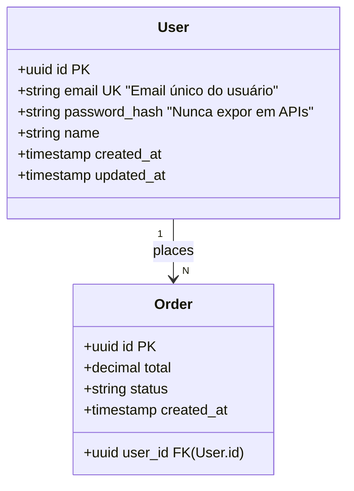
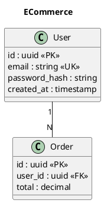

# IDD Domain — Business Model Intent Layer

O `idd domain` é a camada de **intenções do modelo de negócio** do IDD IDE.
Enquanto o `.intent.yaml` declara o que cada módulo de código deve fazer,
o `domain.intent.yaml` declara o que as **entidades do negócio** são e como se relacionam.

## Formatos de entrada suportados

### Mermaid classDiagram (recomendado — nativo no GitHub)



### PlantUML



### YAML nativo IDD

```yaml
domain: ECommerce
version: "1.0.0"

entities:
  - name: User
    table_name: users
    attributes:
      - name: id
        type: uuid
        constraints: [primary_key, auto_generate]
      - name: email
        type: string
        nullable: false
        unique: true
        constraints: [format_email]
    relationships:
      - entity: Order
        cardinality: "1:N"
    business_rules:
      - "Email é imutável após criação"
      - "Senha deve ter mínimo 8 caracteres"
```

## Comandos

### `idd domain init`

Inicializa o projeto com um `domain.mmd` de exemplo e o workflow de CI.

```bash
idd domain init
# → domain.mmd criado
# → .github/workflows/idd-domain-verify.yml criado
```

### `idd domain parse <arquivo>`

Parseia o modelo UML e exibe o AST gerado.

```bash
idd domain parse domain.mmd
# → domínio: ECommerce
# → entidades: User, Order, Product (3)
# → relações: 2
```

### `idd domain normalize [--target=NF]`

Verifica as formas normais do modelo.

```bash
idd domain normalize domain.mmd --target=3NF
idd domain normalize domain.mmd --target=BCNF
idd domain normalize domain.mmd --target=DKNF
```

**Formas normais verificadas:**

| Forma | O que verifica |
|---|---|
| 1NF | Atributos atômicos, sem arrays embutidos, sem grupos repetitivos |
| 2NF | Nenhum atributo não-chave depende apenas de parte da PK composta |
| 3NF | Nenhuma dependência transitiva através de não-chaves |
| BCNF | Todo determinante de FD é superchave |
| 4NF | Nenhuma dependência multivalorada não-trivial |
| 5NF | Nenhuma join dependency não-trivial (relações ternárias) |
| DKNF | Toda constraint é consequência de domain constraints e key constraints |

### `idd domain compile`

Gera os 4 artefatos verificáveis.

```bash
idd domain compile domain.mmd
# → .idd/domain/domain.intent.yaml
# → .idd/domain/schema.jsonb.json
# → .idd/domain/schema.sql
# → .idd/domain/er-diagram.md

# Formatos específicos
idd domain compile --format=sql,jsonb
idd domain compile --out=./db/generated
```

**Artefatos gerados:**

- **`domain.intent.yaml`**: intenções do domínio compatíveis com o formato IDD, com `idd_constraints` derivadas automaticamente dos atributos
- **`schema.jsonb.json`**: JSON Schema draft-07 por entidade para validação de payloads no PostgreSQL
- **`schema.sql`**: `CREATE TABLE` PostgreSQL com PKs UUID, triggers `updated_at`, FKs, índices e tabelas de junção N:M
- **`er-diagram.md`**: diagrama Mermaid `erDiagram` com notação crow foot (renderiza no GitHub)

### `idd domain verify`

Compara o schema real do banco (migrations SQL) com o domain model.

```bash
# Detecta migrations automaticamente (migrations/, db/migrations/, .idd/domain/)
idd domain verify

# Diretório customizado
idd domain verify --migrations=./db/migrations

# Modo CI (saída Markdown para PR comment)
idd domain verify --ci --out=/tmp/report.md
```

## CI/CD automático

O workflow `.github/workflows/idd-domain-verify.yml` gerado pelo `idd domain init`
dispara automaticamente em PRs que alteram migrations ou o domain model:

```yaml
# Em qualquer PR que toca migrations/ ou domain.mmd:
uses: EliezerRosa/idd-ide/.github/workflows/idd-domain-verify.yml@main
```

**Comentário automático no PR:**

```
## ⬡ IDD Domain Verify — ECommerce

| Status | Entidade | Tabela  | Score | Faltando | Tipo ≠ |
|--------|----------|---------|-------|----------|--------|
| 🟢     | User     | users   | 100%  | 0        | 0      |
| 🔴     | Order    | orders  | 45%   | 3        | 1      |

### Detalhes
**🔴 Order**
- ❌ Coluna `total` ausente no schema
- ❌ Coluna `status` ausente no schema
- ⚠ `user_id`: esperado `uuid`, encontrado `integer`

❌ Bloqueado — 1 entidade(s) com divergências críticas
```

## Fluxo recomendado de adoção

```
Semana 1:  idd domain init → editar domain.mmd
Semana 2:  idd domain normalize → atingir 3NF
Semana 3:  idd domain compile → revisar schema.sql gerado
Semana 4:  idd domain verify → integrar com migrations existentes
Contínuo:  CI/CD verifica a cada PR que toca o banco
```
